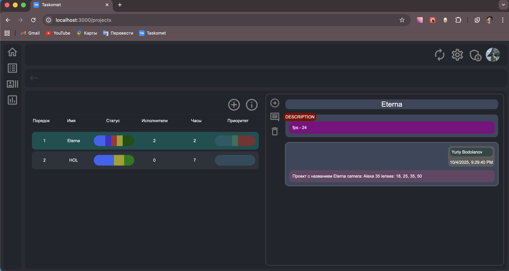
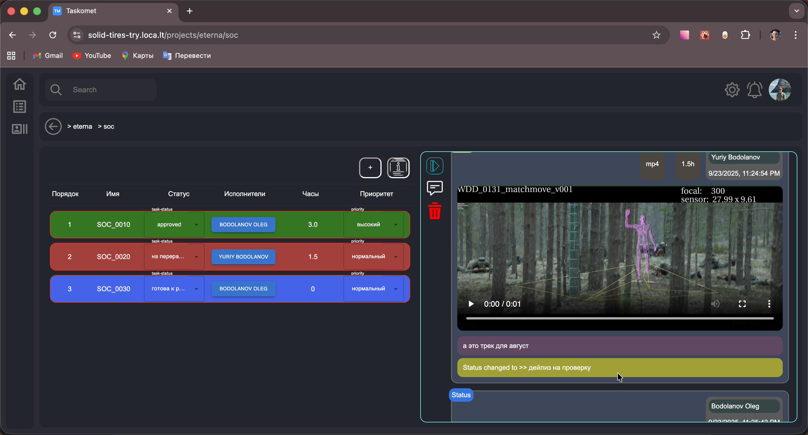
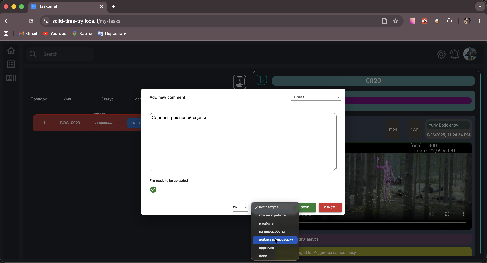
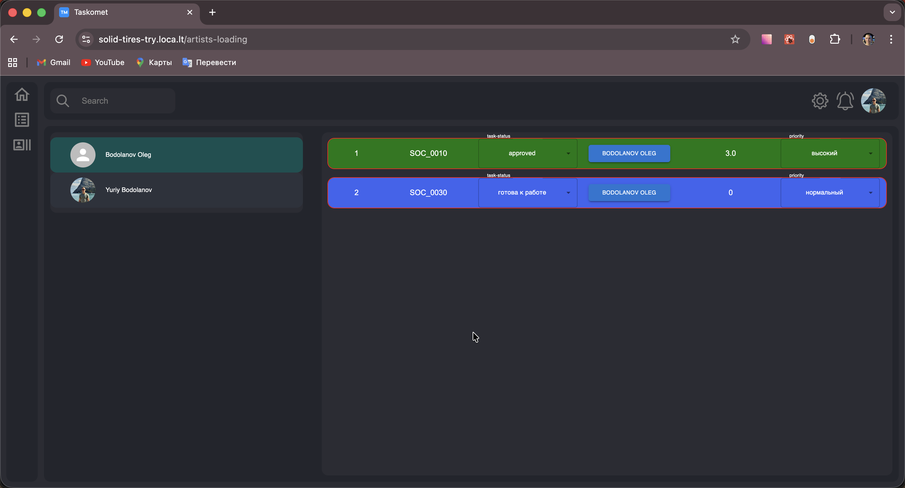

# 🎬 Taskomet

> Таск-менеджер для управления проектами, нацеленный на работу в кино- и анимации. Подразумевает следующую структуру: - проекты → сцены → шоты → таски.

> авторизация через Telegram

> удобный интерфейс

---

## ✨ Возможности

-   🔐 Авторизация через **Telegram**
-   🎬 Иерархия: **Проекты → Сцены → Шоты → Таски**
-   📝 Описание и прикреплённые медиафайлы
-   ✅ Статусы задач и назначение артистов
-   💬 Комментарии

---

## ⚙️ Технологии

> Frontend: React, TypeScript, Zustand, MUI, SASS

> Backend: Node.js, Express, PostgreSQL, fluent-ffmpeg, Vitest

---

## 📸 Скриншоты

---

## RoadMap

-   🎨 Встроенный видеоплеер с возможностью рисовать и комментировать ✍️
-   📢 Уведомления в приложении и в Telegram ✍️
-   📊 Интеграция с **Google Sheets** ✍️
